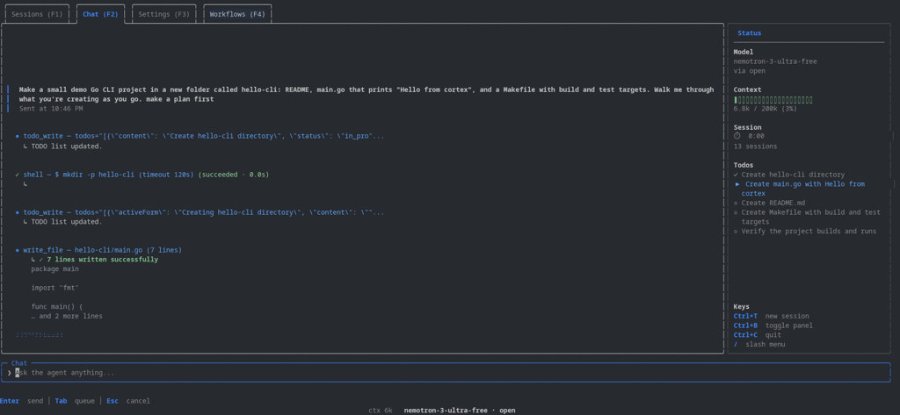

<p align="center">
  
</p>

<p align="center">
  <strong>A fast AI coding agent that lives in your terminal.</strong><br>
  One binary. Beautiful TUI. Your models, your machine.
</p>

<p align="center">
  <a href="LICENSE"></a>
  <a href="https://github.com/Mateooo93/cortex-cli/stargazers"></a>
</p>

<p align="center">
  
</p>

<p align="center">
  <em>Chat, tool calls, todos, and the context panel in one terminal window.</em>
</p>

<p align="center">
  <video src="assets/cortex-cli-demo.mp4" width="920" autoplay loop muted playsinline>
    <a href="assets/cortex-cli-demo.mp4">Watch the cortex-cli demo</a>
  </video>
</p>

<p align="center">
  <em>Demo recording: the agent makes a plan, runs tools, and updates the todo list as it works.</em>
</p>

**cortex-cli** is an open-source coding agent you run in the terminal. Describe what you want in plain language — it reads your repo, edits files, runs commands, searches the web, and keeps working until the job is done. Everything runs locally as a single Go binary with a polished Bubble Tea interface: no daemon, no Docker, no separate cloud agent.

Built for daily development: sessions survive restarts, you can queue messages and spin up parallel workflows without leaving chat, and `/compact` folds long threads into a short summary that keeps the decisions and file paths that matter.

## Why cortex-cli?

- **Instant startup** — single binary, in-process session. No daemon, no Docker, no waiting.
- **Stays in flow** — persistent chat, multi-session support, context usage in the status bar.
- **Bring your own model** — OpenAI, Anthropic, Ollama, Groq, OpenRouter, or sign in with ChatGPT / Claude / Copilot subscriptions.
- **Actually edits your code** — read, write, precise multi-block edits, bash, grep, web search. Safe by default with deny lists and path confirmation.
- **Goes deep when you need it** — goals, multi-agent workflows, and ultracode mode for bigger tasks.

## Quick start

**Install script** (macOS, Linux — no npm auth):

```bash
curl -fsSL https://raw.githubusercontent.com/Mateooo93/cortex-cli/main/script/install.sh | bash
cortex --version
```

**npm** (macOS, Linux, Windows):

```bash
npm install -g @mateooo93/cortex@latest --registry=https://npm.pkg.github.com
cortex
```

If npm returns `E401 Unauthorized`, the GitHub Packages registry needs a read token or the package must be public. Use the install script above, or add to `~/.npmrc`:

```
@mateooo93:registry=https://npm.pkg.github.com
//npm.pkg.github.com/:_authToken=YOUR_GITHUB_TOKEN
```

**Linux** (manual binary):

```bash
curl -fsSL -o cortex https://github.com/Mateooo93/cortex-cli/releases/latest/download/cortex-linux-amd64
chmod +x cortex && mv cortex ~/.local/bin/
cortex
```

**Windows** (PowerShell):

```powershell
irm https://raw.githubusercontent.com/Mateooo93/cortex-cli/main/script/install.ps1 | iex
cortex
```

Then open any project directory and run `cortex`. One-shot without the TUI: `cortex -p "explain this repo"`.

Other platforms and tarballs are on the [latest release](https://github.com/Mateooo93/cortex-cli/releases/latest). To build from source: `git clone`, `go build -o cortex ./cmd/cortex`, `./cortex`.

> **npm note:** Install `@mateooo93/cortex@latest` from GitHub Packages (command above). The package `cortex-cli` on npmjs.org is a different product (CognitiveScale). If `cortex` opens the wrong CLI, run `npm uninstall -g cortex-cli && bun remove -g cortex-cli`, remove stale binaries like `~/.local/bin/cortex`, then `hash -r` and check `which -a cortex`.

## What is cortex-cli?

cortex-cli pairs a terminal UI with an in-process chat session, a multi-provider LLM layer, and a built-in tool set. You stay in one window: chat on the left, optional context panel on the right, slash commands for model switches and workflows, and a command palette when you do not want to remember shortcuts.

**How a session works.** You send a message. The agent plans, calls tools (`read_file`, `edit_file`, `bash`, `grep`, `web_search`, and more), streams results back into the TUI, and loops until it finishes or asks you to confirm something risky. Headless mode (`cortex -p "…"`) runs the same stack without the interface — useful for scripts and CI.

**What makes it different.** Many agents ship as Node wrappers, IDE plugins, or hosted services. cortex-cli is one native binary: session state lives in `~/.cortex/`, providers are pluggable, and subscription OAuth tokens sit in your OS keychain. It extends the [vix](https://github.com/get-vix/vix) agent design with multi-provider support, goals, workflows, swarm roles (planner / developer / reviewer), and a full access policy (`deny_list`, allowed directories, interactive confirmations).

**Who it is for.** Developers who live in the terminal and want a fast, self-hosted agent that respects existing API keys or ChatGPT / Claude / Copilot plans — without tying the workflow to a single vendor or editor.

## Authentication

Pick what fits your setup:

**Subscription sign-in** — run `cortex`, open **Settings** (`F3`) or type `/login`, and sign in with ChatGPT (Codex), Claude, or Copilot. Tokens are stored in the OS keychain.

**API keys** — set one of `OPENAI_API_KEY`, `ANTHROPIC_API_KEY`, `CORTEX_API_KEY`, or point at a local Ollama install. Keys can also be saved from the Settings tab.

**Choose a model** — `/model` or the Settings tab. List configured options with `cortex --list-models`.

## Using it

**Tabs:** Sessions `F1` · Chat `F2` · Settings `F3` · Workflows `F4`

**Worth knowing:**
- `Ctrl+B` — right panel (context, model, keys)
- `Ctrl+P` — command palette
- `Ctrl+T` — new session
- `Enter` — send now · `Tab` — queue for after the current turn
- Type `/` — slash menu (`/model`, `/goal`, `/workflow`, `/compact`, `/effort`, `/update`, `/login`, `/copy`, `/clear`)

**CLI flags:**

```bash
cortex -p "fix the failing test"    # headless one-shot
cortex -m anthropic/claude-sonnet   # pick a model
cortex --workdir ./my-project       # set cwd
cortex --list-models                # show configured models
```

Config lives in `~/.cortex/` (Windows: `%USERPROFILE%\.cortex\`). Project overrides go in `./.cortex/`. See [AGENTS.md](AGENTS.md) for architecture, deny-list semantics, and contributor conventions.

## Development

```bash
make build && make test
./bin/cortex
./bin/cortex -test    # TUI with fake data
```

## License

AGPL-3.0 — see [LICENSE](LICENSE).