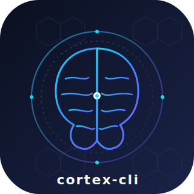
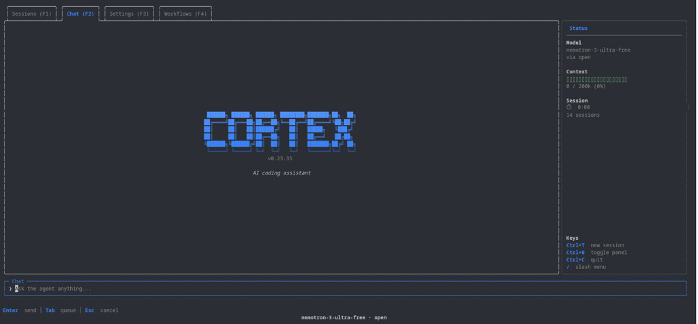

<p align="center">
  
</p>

<p align="center">
  <strong>The open source AI coding agent for your terminal.</strong><br>
  One binary. Beautiful TUI. Your models, your machine.
</p>

<p align="center">
  <a href="LICENSE"></a>
  <a href="https://github.com/Mateooo93/cortex-cli/stargazers"></a>
  <a href="https://github.com/Mateooo93/cortex-cli/releases/latest"></a>
</p>

<p align="center">
  <a href="https://github.com/Mateooo93/cortex-cli">
    
  </a>
</p>

---

**cortex-cli** is a fast coding agent you run in the terminal. Describe what you want in plain language — it reads your repo, edits files, runs commands, searches the web, and keeps working until the job is done. Everything runs locally as a single Go binary with a polished Bubble Tea interface: no daemon, no Docker, no separate cloud agent.

## See it in action

<p align="center">
  
</p>

<p align="center">
  <em>Chat, tool calls, todos, and the context panel in one terminal window.</em>
</p>

## Table of contents

- [See it in action](#see-it-in-action)
- [Installation](#installation)
- [Quick start](#quick-start)
- [Features](#features)
- [Authentication](#authentication)
- [Using it](#using-it)
- [Project memory](#project-memory)
- [Development](#development)
- [Contributing](#contributing)

## Installation

### curl (recommended)

macOS and Linux — no npm auth:

```bash
curl -fsSL https://raw.githubusercontent.com/Mateooo93/cortex-cli/main/script/install.sh | bash
cortex --version
```

### npm

macOS, Linux, and Windows:

```bash
npm install -g @mateooo93/cortex@latest --registry=https://npm.pkg.github.com
cortex
```

If npm returns `E401 Unauthorized`, use the curl installer above, or add to `~/.npmrc`:

```
@mateooo93:registry=https://npm.pkg.github.com
//npm.pkg.github.com/:_authToken=YOUR_GITHUB_TOKEN
```

### Manual download

**Linux:**

```bash
curl -fsSL -o cortex https://github.com/Mateooo93/cortex-cli/releases/latest/download/cortex-linux-amd64
chmod +x cortex && mv cortex ~/.local/bin/
```

**Windows (PowerShell):**

```powershell
irm https://raw.githubusercontent.com/Mateooo93/cortex-cli/main/script/install.ps1 | iex
```

Other platforms and tarballs are on the [latest release](https://github.com/Mateooo93/cortex-cli/releases/latest). Build from source: `git clone`, `go build -o cortex ./cmd/cortex`, `./cortex`.

> **npm note:** Install `@mateooo93/cortex@latest` from GitHub Packages (command above). The package `cortex-cli` on npmjs.org is a different product. If `cortex` opens the wrong CLI, run `npm uninstall -g cortex-cli`, remove stale binaries like `~/.local/bin/cortex`, then `hash -r` and check `which -a cortex`.

## Quick start

```bash
cd your-project
cortex
```

One-shot without the TUI:

```bash
cortex -p "explain this repo"
cortex -m anthropic/claude-sonnet -p "fix the failing test"
cortex --list-models
```

## Features

### Terminal experience

- **One native binary** — instant startup, in-process session. No daemon, no Docker, no Node wrapper.
- **Polished Bubble Tea TUI** — markdown chat, live tool-call cards with diffs, todo list, thinking trace, and a context panel (`Ctrl+B`).
- **Multi-session workspace** — run parallel chats (`Ctrl+T`), switch with `F1`/`F2`, and resume after restart.
- **Stay in flow** — queue follow-ups with `Tab`, see context usage and turn timer in the status bar, copy chat with `/copy` or drag-select.
- **Command palette** — `Ctrl+P` for history search, scroll jumps, and quick actions without memorizing shortcuts.

### Models and auth

- **Bring your own model** — OpenAI, Anthropic, Ollama, Groq, OpenRouter, and more via YAML presets.
- **Subscription sign-in** — ChatGPT (Codex), Claude, Copilot, and xAI Grok OAuth; tokens live in the OS keychain.
- **Fast model switching** — `/model` picker, provider search in Settings, `cortex --list-models` for headless use.
- **Reasoning effort** — `/effort` levels from low through **ultracode** for harder tasks (session-scoped).

### Agent capabilities

- **Full tool belt** — `read_file`, `write_file`, `edit_file` (multi-block patches), `bash`, `grep` / `glob_files`, `web_search`, `web_fetch`, background shells, and `todo_write`.
- **Sub-agents** — `spawn_agent` + `task_output` dispatch parallel specialists (explore, developer, tester, reviewer) without bloating your main context.
- **Autonomous goals** — `/goal <condition>` keeps the agent working until a fast evaluator confirms success (e.g. “all tests pass”).
- **Context management** — `/compact` summarizes long threads; auto-compact at 80% context (toggle in Settings).
- **Project memory** — durable repo knowledge under `.cortex/`; browse with `/memory`, save via `memory_write` ([details](docs/memory.md)).
- **Custom agents** — drop specialist prompts in `.cortex/agents/` and `.cortex/skills/`; layered with `~/.cortex` defaults.

### Safety and config

- **Safe by default** — `deny_list` blocks sensitive paths and URLs; out-of-scope reads/writes prompt for confirmation.
- **Layered config** — `~/.cortex` user defaults + `./.cortex` project overrides (`settings.json`, `AGENTS.md`, agents, skills).
- **Headless mode** — `cortex -p "…"` runs the same agent stack without the TUI (scripts, CI, one-shots).
- **Self-update** — `/update` pulls the latest release from GitHub.

## Authentication

**Subscription sign-in** — run `cortex`, open **Settings** (`F3`) or type `/login`, and sign in with ChatGPT (Codex), Claude, or Copilot. Tokens are stored in the OS keychain.

**API keys** — set `OPENAI_API_KEY`, `ANTHROPIC_API_KEY`, `CORTEX_API_KEY`, or point at a local Ollama install. Keys can also be saved from Settings.

**Choose a model** — `/model` or the Settings tab. List configured options with `cortex --list-models`.

## Using it

**Tabs:** Sessions `F1` · Chat `F2` · Settings `F3`

**Shortcuts:**

| Key | Action |
|-----|--------|
| `Ctrl+B` | Right panel (context, model, keys) |
| `Ctrl+P` | Command palette |
| `Ctrl+T` | New session |
| `Enter` | Send now |
| `Tab` | Queue for after the current turn |
| `/` | Slash menu |

**Slash commands:** `/model` · `/goal` · `/effort` · `/compact` · `/update` · `/login` · `/memory` · `/copy` · `/clear`

Config lives in `~/.cortex/` (Windows: `%USERPROFILE%\.cortex\`). Project overrides go in `./.cortex/`. See [AGENTS.md](AGENTS.md) for architecture, deny-list semantics, and contributor conventions.

## Project memory

Cortex can persist durable project knowledge (preferences, conventions, architecture notes) under each repo's `.cortex/` directory. Browse and search with `/memory`, or let the agent save via the `memory_write` tool. Toggle in Settings.

Full details: [docs/memory.md](docs/memory.md).

## Development

```bash
make build && make test
./bin/cortex
./bin/cortex -test    # TUI with fake data
```

## Contributing

Bug reports, feature ideas, and pull requests are welcome. See [CONTRIBUTING.md](CONTRIBUTING.md) for setup and conventions.

If cortex-cli helps you ship faster, a [star on GitHub](https://github.com/Mateooo93/cortex-cli) goes a long way.

## License

AGPL-3.0 — see [LICENSE](LICENSE).